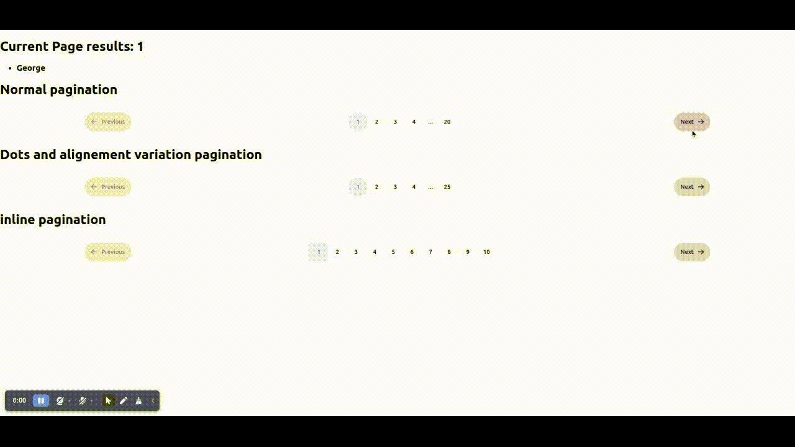

# Common Pagination Component

The Common Pagination Component is a reusable React component designed to simplify the implementation of pagination controls in your web application. It provides flexibility and customization options to create different styles of pagination, including dotted pagination, inline pagination, and more.

## Table of Contents

- [Installation](#installation)
- [Usage](#usage)
- [Props](#props)
- [Examples](#examples)
- [License](#license)

## Installation

To use the Common Pagination Component in your project, follow these steps:

1. Install the component using npm or yarn:

   ```bash
   npm install common-pagination-component
   ```

Import the Common Pagination Component into your React application where you intend to use it:

```
import CommonPagination from 'common-pagination-component';

```

## Usage

- The Common Pagination Component can be used to create pagination controls with various configurations. It supports both simple inline pagination and pagination with ellipses (dots) for larger datasets. Below is an example of how to use it:

```
import React, { useState } from 'react';
import CommonPagination from 'common-pagination-component';

const PaginationDemo: React.FC = () => {
  const [currentPage, setCurrentPage] = useState(1);

  const handlePageChange = (newPage: number) => {
    setCurrentPage(newPage);
  };

  return (
    <div>
      <h1>Current Page: {currentPage}</h1>
      <CommonPagination
        currentPage={currentPage}
        onPageChange={handlePageChange}
        pageSize={10}
        totalCount={100}
        shape="rounded"
      />
    </div>
  );
};

export default PaginationDemo;
```

## Props

- The Common Pagination Component accepts the following props:

* **currentPage(number)** The current active page.
* **onPageChange(function):** A callback function that gets called when a page is clicked.
* **pageSize (number):** The number of items per page.
* **totalCount (number):** The total number of items to be paginated.
* **shape (string, optional):** The shape of pagination buttons (default: 'squared').
* **textColor (string, optional):** The color of the text on pagination buttons (default: '#6366f1').
* **color (string, optional):** The background color of pagination buttons (default: '#eef2ff').
* **siblingCount (number, optional):** The number of sibling page buttons to show (default: 1).
* **startPage (number, optional):** The starting page number for pagination (default: 1).
* **inline (boolean, optional):** Render pagination as a simple list of buttons when set to true (default: false).
* **increaseSibling (boolean, optional):** Allow increasing the number of sibling page buttons when set to true (default: false).

# Example

## Output of pagination types



## Simple Inline Pagination

- In this example, the Common Pagination Component is used to create a simple inline pagination:

```
<CommonPagination
  currentPage={currentPage}
  onPageChange={handlePageChange}
  pageSize={10}
  totalCount={100}
  shape="squared"
  inline={true}
/>
```

## Dotted Pagination with Increased Sibling Pages

- In this example, the Common Pagination Component is used to create pagination with dots and increased sibling pages:

```
<CommonPagination
  currentPage={currentPage}
  onPageChange={handlePageChange}
  pageSize={10}
  totalCount={100}
  shape="rounded"
  increaseSibling={true}
/>

```

Feel free to customize and enhance the Common Pagination Component to suit your project's pagination needs.
